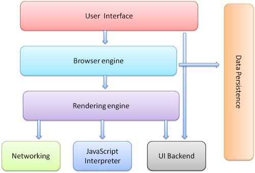
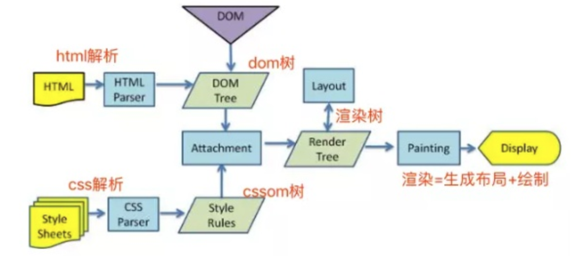
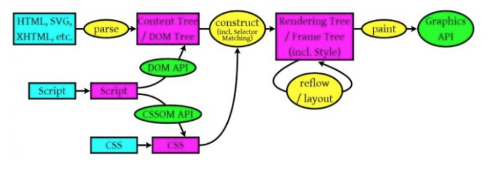
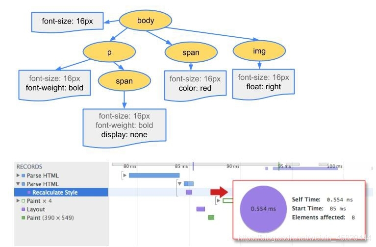
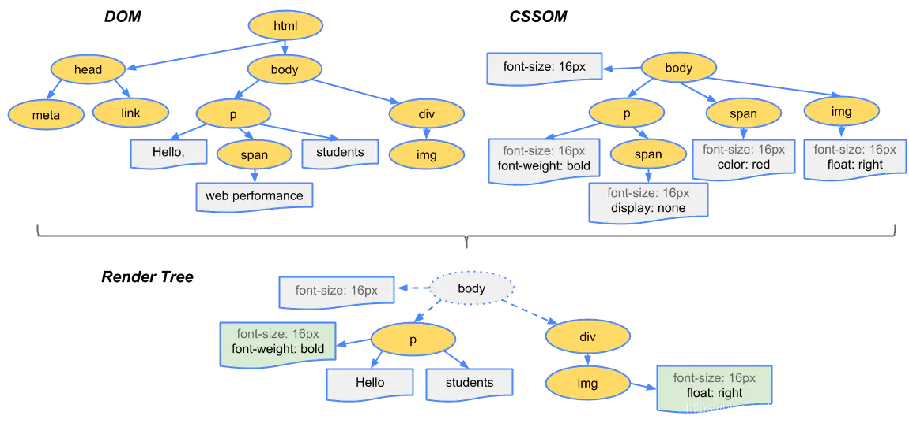
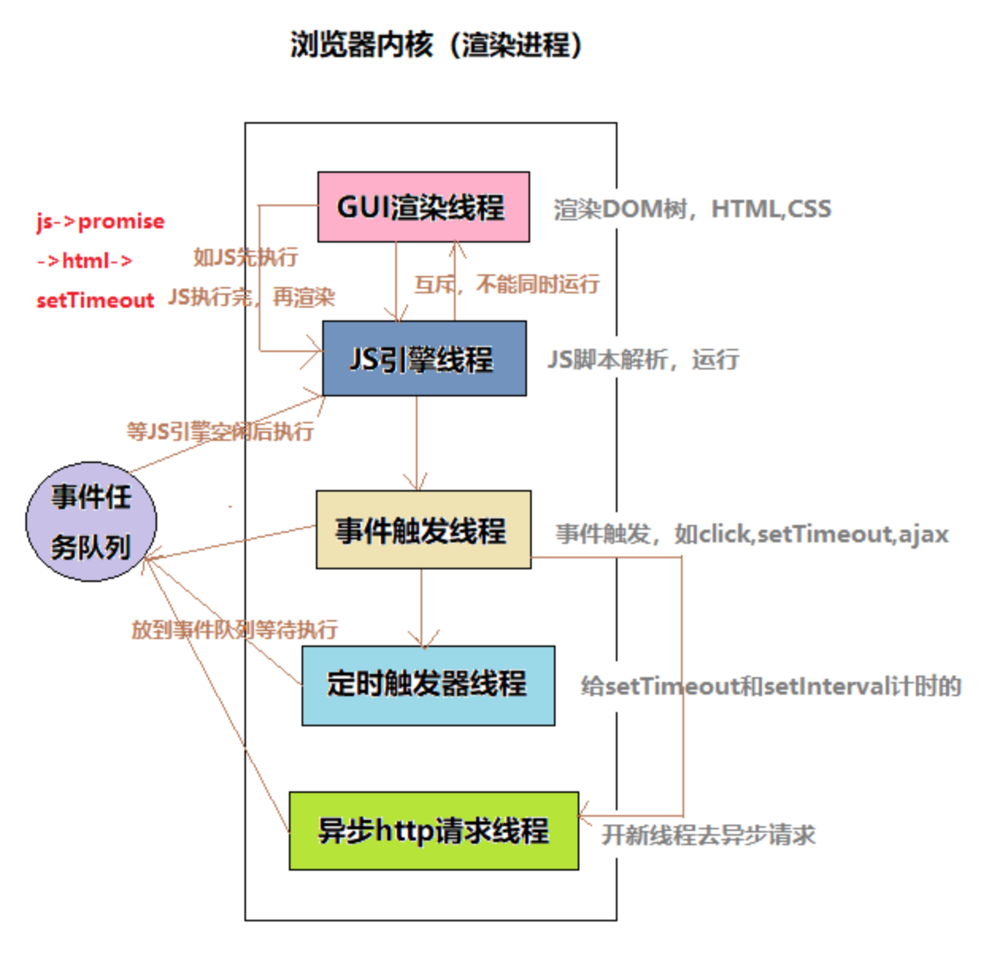

# 浏览器

## 参考

[Dom 树 CSS 树 渲染树(render 树) 规则、原理](https://blog.csdn.net/weixin_45820444/article/details/109013996)

## 功能

请求数据，展示资源

## 7 大模块

- 用户界面 User Interface
  - 主窗口以外的部分
- 浏览器引擎 Browser Engine
  - 在 User Interface 和 Rendering Engine 之间传送指令。
  - 在客户端本地缓存中读写数据等，是浏览器中各个部分之间相互通信的核心
- 渲染引擎 Rendering Engine
  - 负责显示请求的内容。如果请求的内容是 HTML，它就负责解析 HTML 和 CSS 内容，并将解析后的内容显示在屏幕上。
  - 浏览器内核主要指的就是渲染引擎
- 网络 Networking
  - 用来完成网络调用或资源下载的模块，比如 HTTP 请求
- 用户界面后端 UI Backend
  - 用来绘制基本的浏览器窗口内控件，如输入框、按钮、单选按钮等，根据浏览器不同绘制的视觉效果也不同，但功能都是一样的。
- JavaScript 解释器 JavaScript Interpreter
  - 用来解释执行 JS 脚本的模块，如 V8 引擎、JavaScriptCore
- 数据存储 Data Persistence
  - 这是持久层。浏览器需要在硬盘上保存 cookie、localStorage 等各种数据，可通过浏览器引擎提供的 API 进行调用。这是一个完整（但是轻便）的浏览器内数据库

## 渲染引擎

`渲染引擎`，又称`呈现引擎`，也被称为`浏览器内核`，在线程方面又称为 `UI 线程`

### 渲染流程

1. 获取数据
   - 从网络层获取请求文档的内容。
2. 解析数据
   - 解析 HTML 文档，并将各标记逐个转化成“内容树”上的 DOM 节点<b>（dom tree）</b>
   - 同时也会解析外部 CSS 文件以及样式元素中的样式数据<b>（cssom）</b>
   - HTML 中这些带有视觉指令的样式信息（被赋予 css 样式的元素）将用于创建另一个树结构：呈现树<b>（render tree）</b>（包含多个带有视觉属性（如颜色和尺寸）的矩形，这些矩形的排列顺序就是它们将在屏幕上显示的顺序）
3. 布局 Layout
   - 为每个节点分配一个应出现在屏幕上的确切<b>坐标</b>
   - 确定结点大小
4. 绘制 Painting
   - 渲染引擎会遍历呈现树，由<b>用户界面后端层</b>将每个节点绘制出来

> 关键的点在于上述的 4 个过程并不是严格按顺序执行的，渲染引擎会以最快的速度展示内容，所以第二阶段不会等到第一阶段结束才开始，而是在第一阶段有输出的时候就开始执行，其它阶段也是如此。
> 由于浏览器会尝试尽快展示内容，所以内容有时会在样式还没有加载的时候展示出来。

#### HTML 解析规则

- 浏览器从磁盘或网络读取 HTML 的原始字节，并根据文件的指定编码（例如 UTF-8）将它们转换成字符串。
- 在网络中传输的内容其实都是 0 和 1 这些字节数据。当浏览器接收到这些字节数据以后，它会将这些字节数据转换为字符串，也就是我们写的代码。
- 将字符串转换成 Token。Token 中会标识出当前 Token 是“开始标签”或是“结束标签”亦或是“文本”等信息。
- 构建 DOM 的过程中，不是等所有 Token 都转换完成后再去生成节点对象，而是一边生成 Token 一边消耗 Token 来生成节点对象。换句话说，每个 Token 被生成后，会立刻消耗这个 Token 创建出节点对象。

注意：带有结束标签标识的 Token 不会创建节点对象。

#### CSS 解析规则

DOM 会捕获页面的内容，但浏览器还需要知道页面如何展示，所以需要构建 CSSOM。

构建 CSSOM 的过程与构建 DOM 的过程非常相似，当浏览器接收到一段 CSS，浏览器首先要做的是识别出 Token，然后构建节点并生成 CSSOM。

在这一过程中，浏览器会确定下每一个节点的样式到底是什么，并且这一过程其实是很消耗资源的。因为样式你可以自行设置给某个节点，也可以通过继承获得。在这一过程中，浏览器得递归 CSSOM 树，然后确定具体的元素到底是什么样式。

注意：CSS 匹配 HTML 元素是一个相当复杂和有性能问题的事情。所以，DOM 树要小，CSS 尽量用 id 和 class，千万不要过多层叠。

#### 构建渲染树

这棵树是不对外的。当我们生成 DOM 树和 CSSOM 树以后，就需要将这两棵树组合为渲染树。

它的主要作用就是把 HTML 按照一定的布局与样式显示出来，用到了 CSS 的相关知识

#### 布局与绘制

当浏览器生成渲染树以后，就会根据渲染树来进行布局（也可以叫做回流）。这一阶段浏览器要做的事情是要弄清楚各个节点在页面中的确切位置和大小。通常这一行为也被称为“自动重排”。

布局流程的输出是一个“盒模型”，它会精确地捕获每个元素在视口内的确切位置和尺寸，所有相对测量值都将转换为屏幕上的绝对像素。

布局完成后，浏览器会立即发出“Paint Setup”和“Paint”事件，将渲染树转换成屏幕上的像素。

## JavaScript 解释器

JavaScript 解释器就是能够“读懂” JavaScript 代码，并准确地给出代码运行结果的一段程序。

`JavaScript 解释器`，又称为 `JavaScript 解析引擎`，又称为 `JavaScript 引擎`，也可以成为 `JavaScript 内核`，在线程方面又称为 `JavaScript 引擎线程`，比如 Chrome 的 V8 引擎。

## 浏览器多进程架构

- 进程是 CPU 资源分配的最小单位
  > 进程：对于操作系统来说，一个任务就是一个进程，比如打开一个浏览器就是启动了一个浏览器进程，打开一个 Word 就启动了一个 Word 进程。
- 线程是 CPU 调度的最小单位
  > 线程：在一个进程内部，要同时做多件事，就需要同时运行多个“子任务”，我们把进程内的这些“子任务”称为线程。

## 浏览器进程

- 主进程 Browser Process
  - 负责浏览器界面的显示与交互。各个页面的管理，创建和销毁其他进程。网络的资源管理、下载等。
- 第三方插件进程 Plugin Process
  - 每种类型的插件对应一个进程，仅当使用该插件时才创建。
- GPU 进程
- 渲染进程 Renderer Process
  - 称为浏览器渲染进程或浏览器内核，内部是多线程的。主要负责页面渲染，脚本执行，事件处理等。

### 渲染进程

#### GUI (图形用户界面)渲染线程

负责渲染浏览器界面，解析 HTML，CSS，构建 DOM 树和 RenderObject 树，布局和绘制等。

当界面需要重绘（Repaint）或由于某种操作引发回流(reflow)时，该线程就会执行。

注意，GUI 渲染线程与 JS 引擎线程是互斥的，当 JS 引擎执行时 GUI 线程会被挂起（相当于被冻结了），GUI 更新会被保存在一个队列中等到 JS 引擎空闲时立即被执行

当浏览器收到响应的 html 后，该线程开始解析 HTML 文档构建 DOM 树，解析 CSS 文件构建 CSSOM，合并构成渲染树，并计算布局样式，绘制在页面上(HTML 解析规则、CSS 解析规则、渲染流程细节)

当界面样式被修改的时候可能会触发 reflow 和 repaint，该线程就会重新计算，重新绘制，是前端开发需要着重优化的点

#### JS 引擎线程

Javascript 引擎，也称为 JS 内核，负责处理 Javascript 脚本程序。（例如 V8 引擎）

JS 引擎线程负责解析 Javascript 脚本，运行代码。

JS 引擎一直等待着任务队列中任务的到来，然后加以处理，一个 Tab 页（renderer 进程）中无论什么时候都只有一个 JS 线程在运行 JS 程序。

注意，GUI 渲染线程与 JS 引擎线程是互斥的，所以如果 JS 执行的时间过长，这样就会造成页面的渲染不连贯，导致页面渲染加载阻塞。

#### 事件触发线程

归属于浏览器而不是 JS 引擎，用来控制事件循环（可以理解，JS 引擎自己都忙不过来，需要浏览器另开线程协助）

当 JS 引擎执行代码块如 setTimeout 时（也可来自浏览器内核的其他线程，如鼠标点击、AJAX 异步请求等），会将对应任务添加到事件触发线程中

当对应的事件符合触发条件被触发时，该线程会把事件对应处理函数添加到待处理队列的队尾，等待 JS 引擎的处理

注意，由于 JS 的单线程关系，所有这些待处理队列中的事件都得排队等待 JS 引擎处理（当 JS 引擎空闲时才会去执行）

#### 定时触发器线程

传说中的 setInterval 与 setTimeout 所在线程

浏览器定时计数器并不是由 JavaScript 引擎计数的，（因为 JavaScript 引擎是单线程的，如果处于阻塞线程状态就会影响记计时的准确）

因此通过单独线程来计时并触发定时（计时完毕后，添加到事件队列中，等待 JS 引擎空闲后执行）

注意，W3C 在 HTML 标准中规定，规定要求 setTimeout 中低于 4ms 的时间间隔算为 4ms。

#### 异步 http 请求线程

在 XMLHttpRequest 连接后是通过浏览器新开一个线程请求。

当检测到状态变更时，如果设置有回调函数，异步线程就产生状态变更事件，将这个回调再放入事件队列中，再由 JavaScript 引擎执行。

注意：浏览器对同一域名请求的最大并发连接数是有限制的，Chrome 和 Firefox 限制数为 6 个，ie8 则为 10 个。
