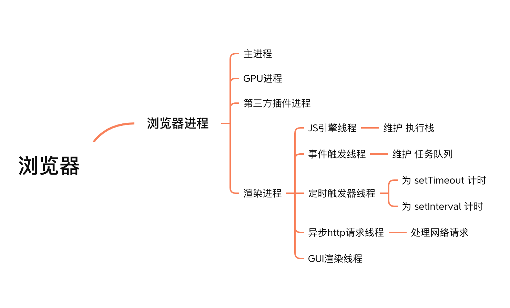

# JavaScript 运行机制

## 学习前所知

js 是单线程的，不能并发执行

主线程处理同步事件，异步时间进入 event table，注册回调函数

js 引擎会不断的检测同步任务栈还有没有任务，如果没有任务，会从事件队列中取任务放到主线程中执行

Event Loop 事件循环

同步任务与异步任务

宏任务与微任务

setTimeout 与 setInterval

Promise 与 process.nextTick()

## 学习资料

阮一峰老师的日志 [JavaScript 运行机制详解：再谈 Event Loop](https://www.ruanyifeng.com/blog/2014/10/event-loop.html)

pudn [JS 运行机制](https://www.pudn.com/news/630dda0288df2007aaf55343.html)

## 笔记

js 是单线程的，也就是说不能同时干多个事情，同一个时间只能做一件事。

单线程容易造成页面卡顿，影响用户体验。

### JavaScript 单线程 和 浏览器多线程

JavaScript 单线程指的是浏览器中负责解释和执行 JavaScript 代码的只有一个线程，即为 JS 引擎线程，但是浏览器的渲染进程是提供多个线程的



### 为什么 js 是单线程的，不能有多线程呢？

主要跟其用途有关，处理页面中用户交互，操作 dom 树、CSS 样式树，不需要多线程，避免出现复杂的同步问题。

> 思考：引入多线程，也就带来了复杂的同步问题，可以用锁加以限制，但是会带来更大的复杂性。

引申：H5 Web Worker 的提出，为了利用多核 CPU 的计算能力，使浏览器的 js 引擎可以并发的执行 js 代码，实现了对浏览器端多线程编程的良好支持。
即便可以创建多个子线程，但是子线程不能操作 dom，受控于主线程。

由于 JavaScript 是可操纵 DOM 的，如果在修改这些元素属性同时渲染界面（即 JavaScript 线程和 UI 线程同时运行），那么渲染线程前后获得的元素数据就可能不一致。

为了防止渲染出现不可预期的结果，<span style="color:#42b983">浏览器设置 <b>UI 渲染线程</b> 与 <b>JavaScript 引擎线程</b> 为互斥的关系</span>，当 JavaScript 引擎线程执行时 UI 渲染线程会被挂起，UI 更新会被保存在一个队列中等到 JavaScript 引擎线程空闲时再执行。

### 同步任务 & 异步任务

同步任务（synchronous）指的是，在<span style="color:#42b983">主线程</span>上排队执行的任务，只有前一个任务执行完毕，才能执行后一个任务；

异步任务（asynchronous）指的是，不进入主线程、而进入<span style="color:#42b983">"任务队列"（task queue）</span>的任务，只有"任务队列"通知主线程，某个异步任务可以执行了，该任务才会进入主线程执行。

### 实现异步的方法

- 延迟类：setTimeout、setInterval、requestAnimationFrame、setImmediate
- 监听事件实现：监听 new Image 加载状态、监听 script 加载状态、监听 iframe 加载状态、message
- 类型：Promise、ajax

### 如何做到 JS 异步非阻塞

当遇到计时器、DOM 事件监听或者是网络请求的任务时，JS 引擎会将它们直接交给 webapi 去处理，也就是浏览器提供的相应线程(如定时触发器线程处理 setTimeout 计时、异步 http 请求线程处理网络请求)，而 JS 引擎线程继续后面的其他任务，这样便实现了异步非阻塞。

如定时器触发线程，只是为 setTimeout(callback, 1000) 定时而已，时间一到就会把对应的回调函数(callback)交给<b>任务队列</b>去维护，JS 引擎线程会去任务队列取出任务并执行。

### 执行栈与任务队列

> 栈 是一种 LIFO（Last In, First Out）的数据结构，特点即 后进先出。

<span style="color:#42b983">JS 引擎会维护一个执行栈</span>，同步代码会依次加入执行栈后执行，结束后退出执行栈；
如果执行栈里的任务执行完毕，即执行栈为空的时候，js 引擎线程空闲，事件触发线程才会从消息队列取出一个任务放入执行栈执行。

```js
const bar = () => console.log("bar");
const baz = () => console.log("baz");
const foo = () => {
  console.log("foo");
  bar();
  baz();
};
foo();
```


> 队列 是一种 FIFO(First In, First Out) 的数据结构，它的特点就是 先进先出。

<span style="color:#42b983">事件触发线程，由浏览器渲染引擎提供，会维护一个任务队列。</span>JS 引擎线程遇到异步(DOM 事件监听、网络请求、setTimeout 计时器等...)，会交给相应的线程单独去维护异步任务，等待时机(计时器结束、网络请求成功、用户点击 DOM)，然后由<u><span style="color:#42b983">事件触发线程</span>将异步对应的 回调函数 加入到任务队列中</u>，任务队列中的回调函数等待被执行。

### 任务队列的维护

js 主线程有一个事件队列，这个事件队列由事件触发线程维护，其他的线程(如定时器触发线程或 http 线程）也有自己的任务队列，当这些线程的事件执行完成的时候，相应的回调函数首先被放入自己事件队列中去，然后由事件触发线程将其放入到 js 主线程的事件队列里，js 主线程会在栈被清空时去执行自己的事件队列。这就是事件触发线程对 js 主线程任务队列的维护。

#### Event Table

一个异步事件与对应的回调函数的对应表

#### 任务队列 Event Queue

回调函数的队列，亦称为 Callback Queue，当 Event Table 中的事件被触发，事件对应的 回调函数 就会被 push 进这个 Event Queue，然后等待被执行。

### 运行机制如下

1. 所有同步任务都在主线程上执行，形成一个执行栈 execution context stack
2. 主线程之外，存在一个任务队列 task queue，只要异步任务有了运行结果，就在 任务队列 之中放置一个事件
3. 一旦执行栈中的所有同步任务执行完毕，系统就会读取任务队列，获取待处理事件对应的异步任务，结束等待状态，进入主线程执行栈执行
4. 主线程重复上面的第三步


### 任务队列的类型

> 宏任务 与 微任务

宏队列 macrotask queue 【tasks】

> 唯一，整个事件循环当中，仅存在一个，执行为同步。

- setTimeout
- setInterval
- I/O
- requestAnimationFrame (浏览器独有)
- UI rendering (浏览器独有)
- setImmediate (Node 独有)

微队列 microtask queue 【jobs】

> 不唯一，存在一定的优先级（用户 I/O 部分优先级更高）；异步执行，同一事件循环中，只执行一个。

- Promise
- Object.observe
- MutationObserver
- process.nextTick (Node 独有)

### 事件循环 event loop

1. 全局代码执行完毕后，调用栈 Stack 会清空。
2. 然后从微队列 microtask queue 中取出位于队首的回调任务，放入调用栈 Stack 中执行，执行完后 microtask queue 长度减 1，
3. 继续取出位于队首的任务，放入调用栈 Stack 中执行，以此类推，直到直到把 microtask queue 中的所有任务都执行完毕。

   > 注意，如果在执行 microtask 的过程中，又产生了 microtask，那么会加入到队列的末尾，也会在这个周期被调用执行

4. microtask queue 中的所有任务都执行完毕，此时 microtask queue 为空队列，调用栈 Stack 也为空，取出宏队列 macrotask queue 中位于队首的任务，放入 Stack 中执行。
5. 每执行一个宏任务，完毕以后都会再次检查是否有微任务产生，如果有微任务产生，则执行微任务。（这就是事件循环机制）

micro-task 必然是在某个宏任务执行的时候创建的。

如果当前执行栈(call stack)还没有执行完毕，是不会执行下一个宏任务和微任务的。


